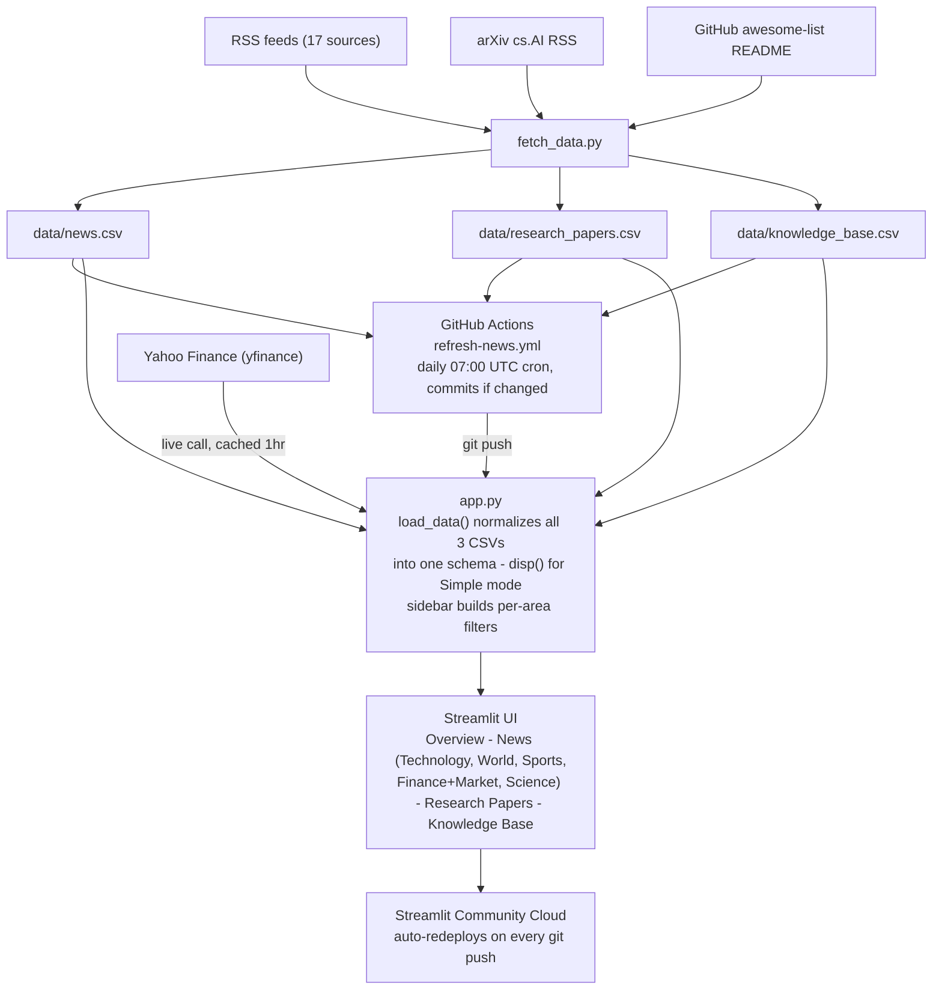

# Architecture

How data flows from source to screen in Daily News Digest.

## Layers, bottom-up

1. **Data sources** — four independent origins, all free, no API keys: RSS feeds (News), arXiv's
   `cs.AI` RSS (Research Papers), a single GitHub repo's README (Knowledge Base), and Yahoo
   Finance via `yfinance` (Market Snapshot — fetched live in-app, not batched into a CSV, since
   prices move faster than daily news).
2. **Ingestion** — `scripts/fetch_data.py` has one fetch function per area (News, Research
   Papers, Knowledge Base), each writing its own CSV. Deliberately three separate files, not one
   combined table, so each dataset can have its own schema, trust model, and refresh logic.
3. **Automation** — `.github/workflows/refresh-news.yml` runs the fetch script daily (cron,
   07:00 UTC) or on manual dispatch, and commits the CSVs back to the repo only if the data
   actually changed.
4. **Application layer** — `app.py` loads all three CSVs and normalizes them into one shared
   schema (`area`, `category`, `color`, `emoji`, `published`, `summary`, `url`), which is what
   lets the Overview tab compile stats across all three areas without three parallel code paths.
   `disp()` swaps in plain-language labels when Simple mode is on; the sidebar builds per-area
   filters (News topics/sources/dates, Research fields, Knowledge Base sections).
5. **Presentation** — Streamlit UI: four top-level tabs, nested sub-tabs (Technology's five
   sub-topics; Research's seven fields), Plotly charts using a validated colorblind-safe
   palette, pastel-themed cards.
6. **Deployment** — Streamlit Community Cloud, connected directly to the GitHub repo. Any push —
   including the daily Action's auto-commit — triggers an automatic redeploy within a minute or
   two, so the live app always reflects the latest data and code without a manual deploy step.

*(Renders as an actual diagram in GitHub's file viewer and in VS Code's Markdown preview.
Google Docs doesn't render Mermaid — if you need this in the doc, screenshot the rendered
diagram from GitHub or VS Code and paste it in as an image instead of pasting the raw text.)*
